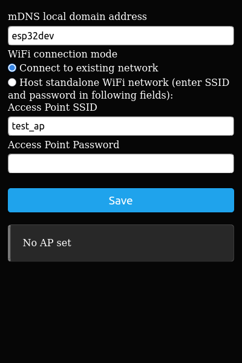
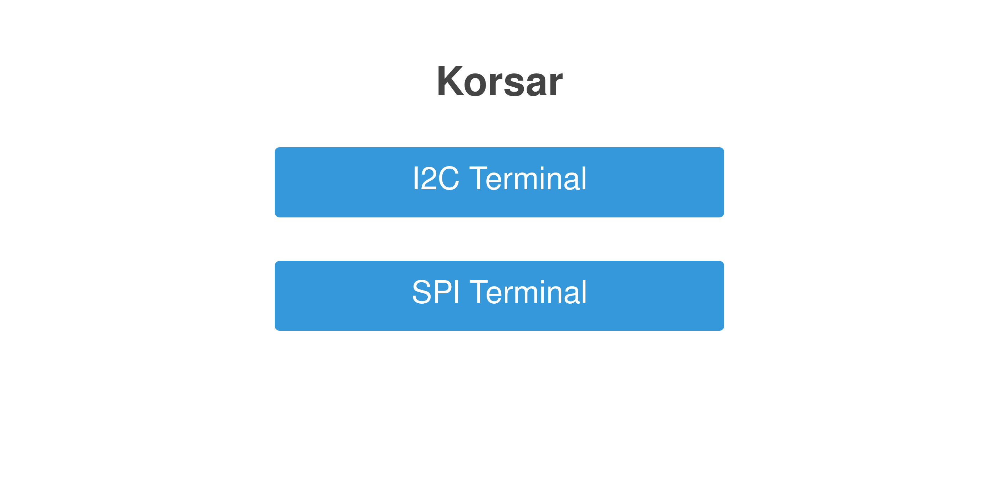
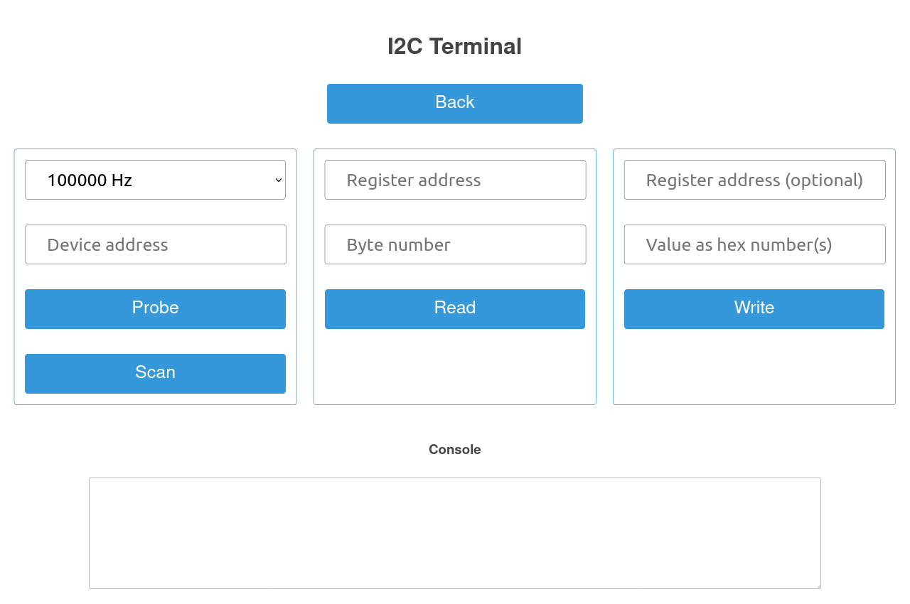

<a id="readme-top"></a>

[![Stargazers][stars-shield]][stars-url]
[![Issues][issues-shield]][issues-url]


<!-- PROJECT LOGO -->
<br />
<div align="center">
  <h3 align="center">Korsar</h3>

  <p align="center">
    Hardware interface multitool for hackers, that requires no special hardware
    <br />
    <!--<a href="https://github.com/othneildrew/Best-README-Template"><strong>Explore the docs »</strong></a>
    <br /> -->
    <br />
    <a href="https://github.com/GCME-BW/Korsar/releases">Releases</a>
    &middot;
    <a href="https://github.com/GCME-BW/Korsar/issues">Report Bug</a>
    &middot;
    <a href="https://github.com/GCME-BW/Korsar/issues">Request Feature</a>
  </p>
</div>


<!-- TABLE OF CONTENTS -->
<ol>
  <li>
    <a href="#about-the-project">About The Project</a>
  </li>
  <li>
    <a href="#getting-started">Getting Started</a>
    <ul>
      <li><a href="#prerequisites">Prerequisites</a></li>
      <li><a href="#installation">Installation</a></li>
      <li><a href="#initial-configuration">Initial configuration</a></li>
      <li><a href="#building">Building</a></li>
    </ul>
  </li>
  <li>
    <a href="#usage">Usage</a>
    <ul>
      <li><a href="#i2c-terminal">I2C</a></li>
      <li><a href="#spi-terminal">SPI</a></li>
      <li><a href="#pinout">Pinout</a></li>
    </ul>
  </li>
  <li><a href="#contributing">Contributing</a></li>
  <li><a href="#license">License</a></li>
  <li><a href="#contact">Contact</a></li>
</ol>


<!-- ABOUT THE PROJECT -->
## About The Project

This tool is designed to interact with different hardware interfaces (I2C, SPI, etc) as easy, as with UART via serial monitor.\
Its like good old Bus Pirate, but with no special hardware: just download firmware and install it on your ESP32.\
Interface works directly in browser, so you don't even need to install additional software on your PC/smartphone to use Korsar.

<p align="right">(<a href="#readme-top">back to top</a>)</p>


<!-- GETTING STARTED -->
## Getting Started

### Prerequisites

At first, you need to have ESP32 board as platform. For now pre-built binaries available only generic ESP32, but firmware is also builtable for other kinds of ESP (ESP32S2, ESP32C3, etc).\
For firmware installation you need PC with installed `esptool`.\
For usage of already flashed device  in normal mode, you need WiFi network and any client device with browser in this network.\
For usage of already flashed device with SoftAP mode, you need only WiFi-connectable device with browser (any modern computer or smartphone).

### Installation

1. Download latest versions of binary.
2. Connect your device to computer with USB cable.
3. Flash firmware using esptool: `esptool.py --chip esp32 --port <your-port> --baud 460800 write_flash -z 0x1000 <firmware-file.bin>` (don't forget to replace `<your-port>` and `<firmware-file.bin>` with your values). You can also use any other software for flashing, for example Huhn Web Flasher [https://esp.huhn.me/](https://esp.huhn.me/)

### Initial configuration

Connect flashed board to power supply and open WiFi list on your pc/smartphone:


> If you already configured your device and want to change connection settings, [go to this section](#resetting-connection-settings)

Find AP of your board and connect. It has standard name for new ESP device, like `ESP32_<chip_id>`.\
Then open `192.168.0.1` (throught captive portal or manually) in your browser.\
You will see WiFi Manager page:


Now you have two options:
1. [Connect Korsar to existing WiFi network](#connecting-to-existing-wlan)
2. [Setup standalone access point (SoftAP)](#setting-standalone-wlan-softap-up)

#### Connecting to existing WLAN

Press button `Configure WiFi` on WiFi Manager page. Then choose your network, enter password and connect:


Device will reboot and connect to your WLAN. Wait a bit, until if will be ready, and then try to access `http://esp32dev.local` in browser.\

If you can see menu page, you finished initial setup successfully.

Troubleshooting:
1. If Korsar can not connect to network (you entered wrong SSID/password, etc), Korsar will return to configuration mode after 20 seconds timeout. Try again with correct credentials.
2. If Korsar connected to network, but you can not reach it's web page, try to open page directly by IP address (obtain this address from router settings, network scanner, etc.). If you can reach Korsar web interface throught IP address, but not throught mDNS domain, it means that mDNS is not supported by your client device (pc/smartphone). In this case, search guide for mDNS setup for your OS, or access Korsar directly by IP.
3. If ypu can not reach Korsar web interface throught mDNS domain nor IP, but its connected to your WLAN, it means that your WLAN blocks direct connections between hosts in network. Usually you can meet this problem in correctly secured public networks. In this case, this WLAN is not suitable for Korsar, and you have to use it throught [standalone WLAN (SoftAP)](#setting-standalone-wlan-softap-up).

#### Setting standalone WLAN (SoftAP) up

Press button `Setup` on WiFi Manager page. Then set checkbox to `Host standalone WiFi network` and enter SSID and password of standalone network you want to create and save settings:



Now you can connect to this WiFi access point and open Korsar's web interface on `http://192.168.0.1` or `http://esp32dev.local`.

#### Resetting connection settings

Press `Boot` (may have other name) button on your board and hold one second to remove connection settings.\
Then [configure device again](#initial-configuration).

### Building

If you just want to use this tool, you don't need to build it, just install from binary.\
If you want to develop or debug, launch your favorite IDE ith PlatformIO and perform following actions (exact way may depend on which IDE are you using as host for PlatformIO):

1. Clone the repo
   ```sh
   git clone https://github.com/GCME-BW/Korsar
   ```
2. Open project folder with IDE with PlatformIO plugin and install all the dependincies
3. Build project and flash firmware
4. Upload filesystem image, using PlatformIO


<p align="right">(<a href="#readme-top">back to top</a>)</p>


<!-- USAGE EXAMPLES -->
## Usage

At first, [install](#installation) and [configure](#initial-configuration) Korsar according to manual and [open](#initial-configuration) Korsar interface in browser.

For now, Korsar supports I2C and SPI exploring (other protocols will be added later, support of some higher-level things also planned).



### I2C Terminal



With this tool you can interact with I2C slave devices on bus. Two speeds are available: 100kHz and 400kHz. 

If you don't know address of your target device or need to check if all device are available on bus, press `Scan`. Software will print list of devices on bus and try to guess model of device.

To read value from register, enter register number and quantity of bytes to read. Register number is hex by default and byte quantity is decimal. If register address is multi-byte, enter several bytes of address, separated with spaces.

To write some value, enter register address and bytes to write, separated with spaces. Register address may be left blank, if its not needed.

At the end of operation, you will get success or error text in `Console` block.

### SPI Terminal


With this tool you can interact with SPI slave devices. Following interface settings are available: speed, significant byte (MSB/LSB), SPI mode (clock polarity and phase).

To write some value, simply enter bytes to write, separated with spaces.

`Write&Read` could be used to read value from register or to do some action, specific for target device: firstly it sends some bytes to device, then reads expected number of bytes from it. Enter bytes to send separated with space, number of expected bytes of response and `placeholder byte` (byte, that should be sent each time to request next byte of answer usually its 0x00, or sometimes 0xFF; it depends on your target device).

### Pinout


Interfaces are connected to their default pins, with no remap:

| Pin name | №   |
| -------- | --- |
| I2C SDA  | 21  |
| I2C SCL  | 22  |
| SPI CS   | 5   |
| SPI SCK  | 18  |
| SPI MISO | 19  |
| SPI MOSI | 23  |

<p align="right">(<a href="#readme-top">back to top</a>)</p>


<!-- CONTRIBUTING -->
## Contributing

Any contribution is welcome.\
If you have a suggestion that would make this better, please fork the repo and create a pull request. You can also simply open an issue with the tag "enhancement".

<!-- LICENSE -->
## License

Firmware part of project distributed under the GPL-2.0 License, according to licensing conditions of libraries, that are used. See `GPL-2.0-LICENSE.txt` for more information.

Web pages and any other non-firmware parts of project distributed under the MIT License. See `MIT-LICENSE.txt` for more information.

<p align="right">(<a href="#readme-top">back to top</a>)</p>


<!-- CONTACT -->
## Contact

Andrey - gcme-bw@mailbox.org

Project Link: [https://github.com/GCME-BW/Korsar](https://github.com/GCME-BW/Korsar)

<p align="right">(<a href="#readme-top">back to top</a>)</p>


<!-- MARKDOWN LINKS & IMAGES -->
<!-- https://www.markdownguide.org/basic-syntax/#reference-style-links -->
[contributors-shield]: https://img.shields.io/github/contributors/GCME-BW/Korsar.svg?style=for-the-badge
[contributors-url]: https://github.com/GCME-BW/Korsar/graphs/contributors
[forks-shield]: https://img.shields.io/github/forks/GCME-BW/Korsar.svg?style=for-the-badge
[forks-url]: https://github.com/GCME-BW/Korsar/network/members
[stars-shield]: https://img.shields.io/github/stars/GCME-BW/Korsar.svg?style=for-the-badge
[stars-url]: https://github.com/GCME-BW/Korsar/stargazers
[issues-shield]: https://img.shields.io/github/issues/GCME-BW/Korsar.svg?style=for-the-badge
[issues-url]: https://github.com/GCME-BW/Korsar/issues
